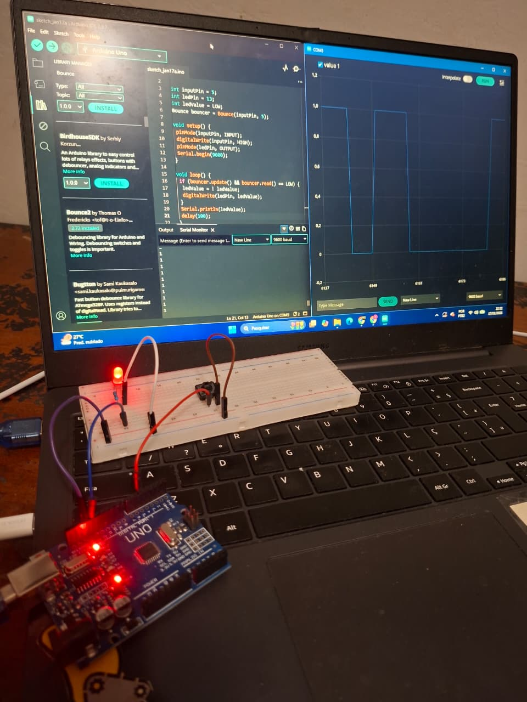
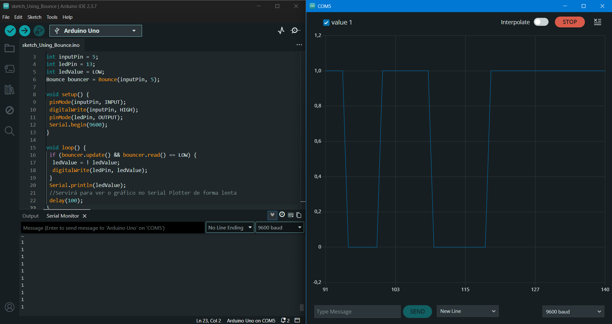

# Projeto Arduino – Leitura de Botão com Debounce usando Biblioteca Bounce

## 1. Visão geral

Este projeto demonstra **como tratar corretamente o efeito de *bounce*** (repique mecânico) de um botão físico utilizando a **biblioteca Bounce** no Arduino.

O sketch:

* Lê um botão conectado ao pino digital **5**;
* Aplica *debounce* por software com a biblioteca **Bounce**;
* Alterna o estado do LED do Arduino (**pino 13**) a cada acionamento válido do botão;
* Envia o valor lógico do LED para o **Serial Monitor / Serial Plotter**.

O objetivo é **garantir leitura confiável**, evitando múltiplas leituras falsas causadas pelo ruído mecânico do botão.

---

## 2. Hardware utilizado

* Arduino Uno
* 1 botão (push button)
* 1 LED (ou LED onboard do Arduino Uno)
* Protoboard
* Jumpers

### Ligações

| Componente | Pino Arduino |
| ---------- | ------------ |
| Botão      | D5           |
| LED        | D13          |
| GND        | GND          |

O botão é configurado com **pull-up interno**, dispensando resistor externo.

---

## 3. Biblioteca utilizada

### Bounce

Biblioteca específica para *debounce* de entradas digitais.

Instalação via Arduino IDE:

1. Sketch → Include Library → Manage Libraries
2. Pesquise por **Bounce**
3. Instale a biblioteca **Bounce by Thomas O. Fredericks**

Referência oficial:

* [https://github.com/thomasfredericks/Bounce2](https://github.com/thomasfredericks/Bounce2)

---

## 4. Explicação do código

### 4.1 Definição de pinos e variáveis

```cpp
int inputPin = 5;
int ledPin = 13;
int ledValue = LOW;

Bounce bouncer = Bounce(inputPin, 5);
```

* `inputPin`: pino do botão
* `ledPin`: pino do LED
* `ledValue`: estado atual do LED
* `Bounce(inputPin, 5)`: aplica *debounce* de **5 ms**

---

### 4.2 Função setup()

```cpp
void setup() {
  pinMode(inputPin, INPUT);
  digitalWrite(inputPin, HIGH);
  pinMode(ledPin, OUTPUT);
  Serial.begin(9600);
}
```

* `digitalWrite(inputPin, HIGH)` ativa o **pull-up interno**;
* O botão passa a operar em lógica **ativo em LOW**;
* Comunicação serial iniciada em **9600 baud**.

---

### 4.3 Função loop()

```cpp
void loop() {
  if (bouncer.update() && bouncer.read() == LOW) {
    ledValue = !ledValue;
    digitalWrite(ledPin, ledValue);
  }

  Serial.println(ledValue);
  delay(100);
}
```

Fluxo lógico:

1. `bouncer.update()` verifica se houve mudança estável no botão;
2. `bouncer.read() == LOW` confirma acionamento válido;
3. O LED alterna entre ligado/desligado;
4. O estado é enviado ao Serial Monitor;
5. `delay(100)` desacelera a visualização no Serial Plotter.

Resultado: **1 clique = 1 ação**, sem leituras duplicadas.

---

## 5. Serial Monitor e Serial Plotter

* **Serial Monitor**: exibe `0` ou `1` conforme o estado do LED;
* **Serial Plotter**: permite visualizar graficamente as transições do botão.

---

## 6. Estrutura recomendada do repositório

```
/button-with-arduino-and-bounce
│
├── README.md
├── sketch_Using_Bounce.ino
│
├── src/
│   ├── arduino_breadboard.jpg
│   ├── arduino.gif
│   └── serial_plotter.png
```
### Exemplo – Circuito em Funcionamento

md


### Exemplo – Montagem do circuito





### Exemplo – Serial Plotter

```md

```

---

## 8. Conclusão

Este projeto é um **exemplo técnico correto** de uso da biblioteca Bounce para tratamento de *debounce* em botões físicos.

É base sólida para:

* Sistemas de controle;
* Interfaces homem-máquina;
* Projetos com múltiplos botões;
* Migração futura para ESP32.

Sem debounce adequado, o projeto falha, pois o Arduino lê como se o botão fosse apertado várias vezes e causa interferência elétrica e o LED liga e desliga rapidamente.
